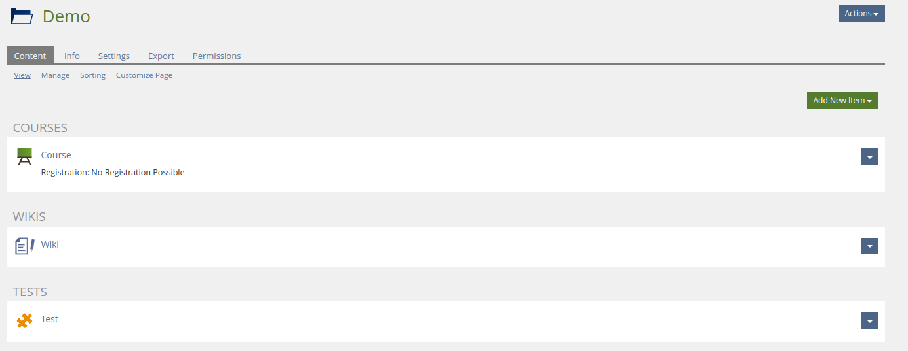
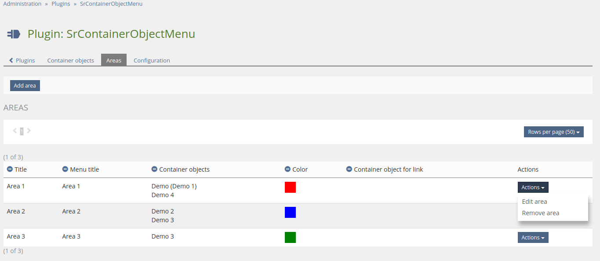
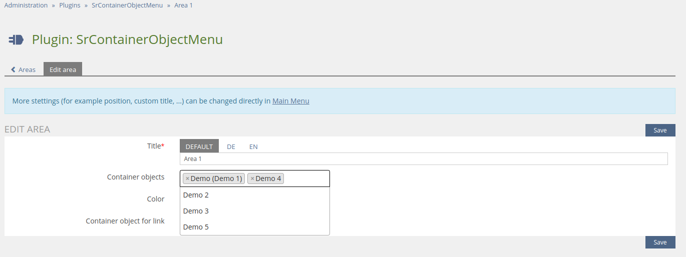
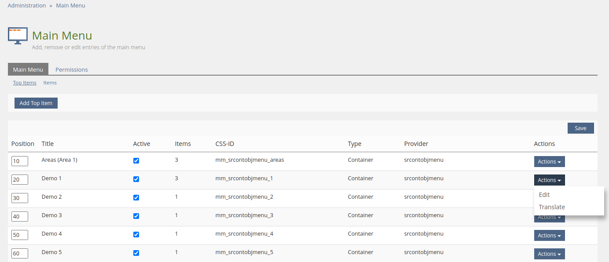

<!-- Autogenerated from composer.json - All changes will be overridden if generated again! -->

# SrContainerObjectMenu ILIAS Plugin

Provide repository container objects in main menu as dropdown items

This is an OpenSource project by studer + raimann ag, CH-Burgdorf (https://studer-raimann.ch)

This project is licensed under the GPL-3.0-only license

## Requirements

* ILIAS 5.4.0 - 6.999
* PHP >=7.0

## Installation

Start at your ILIAS root directory

```bash
mkdir -p Customizing/global/plugins/Services/UIComponent/UserInterfaceHook
cd Customizing/global/plugins/Services/UIComponent/UserInterfaceHook
git clone https://github.com/studer-raimann/SrContainerObjectMenu.git SrContainerObjectMenu
```

Update, activate and config the plugin in the ILIAS Plugin Administration

## Description

### Container objects

You can select repository container objects in the plugin config

The plugin provides it as main menu dropdowns items with the objects children

You can adjust the position and custom title of container objects in the main menu configuration

#### Container objects table


#### Add container object form


#### Edit container object form


#### Repository object



#### Main menu


### Areas

If you use much container objects, on which the user has access (For example admin users), the main menu may will confused, and the display much main menu items

You can create areas and assign container objects to it

An additional main menu container item will be provided, in which the user can select an area and only its container objects will be shown in main menu and makes the main menu clear

The selection of area is personally and retains after relogin tooo

Container objects without areas will display still for the user, independently of area selection

#### Areas table



#### Add area form


#### Edit area form



#### Main menu items table



#### Main menu area 1


#### Main menu area 2


#### Main menu area 3


### Config

#### Config form


### Known issues

#### Lost main menu items

May some lost items will stay in the main menu administration, if you change the position of children or delete children

If you delete container objects or areas from the plugin or uninstall the plugin, the main menu items are automatic clean up

Otherwise, you can ignore the lost main menu items because not viewed in the menu or delete it manually

The plugin has a manual action too for delete lost menu items of the plugin, which is more advanced than the core action is

### Use selected area color and title in skin

You can use the selected area color and title in your skin like with CSS native variables, which the plugin are delivered

```
background-color: var(--srcontainerobjectmenu_area_color, #000000);
content: var(--srcontainerobjectmenu_area_title, "Empty");
```

The second parameter is a fallback value, if the plugin is disabled in the update state

Or use in JS too

```js
getComputedStyle(document.documentElement).getPropertyValue("--srcontainerobjectmenu_area_color") || "#000000";
getComputedStyle(document.documentElement).getPropertyValue("--srcontainerobjectmenu_area_title") || "Empty";
```

### Custom event plugins

If you need to adapt some custom SrContainerObjectMenu changes which can not be configured to your needs, SrContainerObjectMenu will trigger some events, you can listen and react to this in an other custom plugin (plugin type is no matter)

First create or extend a `plugin.xml` in your custom plugin (You need to adapt `PLUGIN_ID` with your own plugin id) to tell ILIAS, your plugins wants to listen to SrContainerObjectMenu events (You need also to increase your plugin version for take effect)

```xml
<?php xml version = "1.0" encoding = "UTF-8"?>
<plugin id="PLUGIN_ID">
	<events>
		<event id="Plugins/SrContainerObjectMenu" type="listen" />
	</events>
</plugin>
```

In your plugin class implement or extend the `handleEvent` method

```php
...
require_once __DIR__ . "/../../SrContainerObjectMenu/vendor/autoload.php";
...
class ilXPlugin extends ...
...
	/**
	 * @inheritDoc
	 */
	public function handleEvent(/*string*/ $a_component, /*string*/ $a_event, /*array*/ $a_parameter)/* : void*/ {
		switch ($a_component) {
			case IL_COMP_PLUGIN . "/" . ilSrContainerObjectMenuPlugin::PLUGIN_NAME:
				switch ($a_event) {
					case ilSrContainerObjectMenuPlugin::EVENT_...:
						...
						break;

					default:
						break;
				}
				break;

			default:
				break;
		}
	}
...
```

| Event | Parameters | Purpose |
|-------|------------|---------|
| `ilSrContainerObjectMenuPlugin::EVENT_CHANGE_MENU_ENTRY` | `entry => &AbstractBaseItem`<br>`obj_id => int` | Change menu entry (Please note `entry` is a reference variable, if it should not works) |

## Adjustment suggestions

You can report bugs or suggestions at https://plugins.studer-raimann.ch/goto.php?target=uihk_srsu_PLCOM

There is no guarantee this can be fixed or implemented

## ILIAS Plugin SLA

We love and live the philosophy of Open Source Software! Most of our developments, which we develop on behalf of customers or on our own account, are publicly available free of charge to all interested parties at https://github.com/studer-raimann.

Do you use one of our plugins professionally? Secure the timely availability of this plugin for the upcoming ILIAS versions via SLA. Please inform yourself under https://studer-raimann.ch/produkte/ilias-plugins/plugin-sla.

Please note that we only guarantee support and release maintenance for institutions that sign a SLA.
